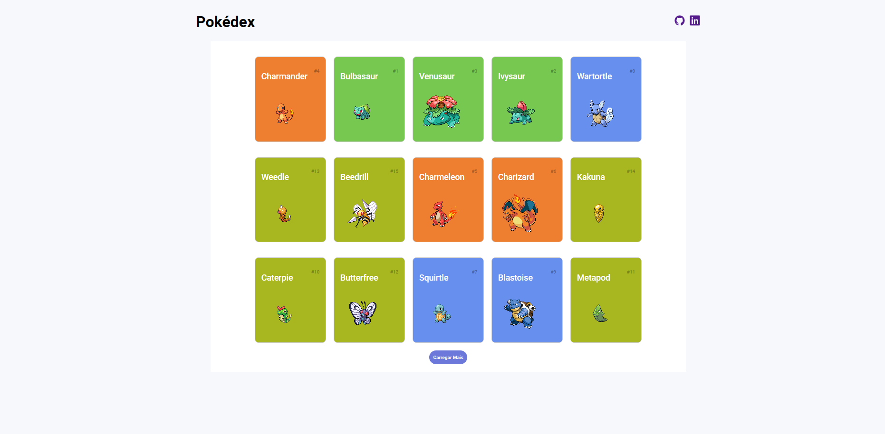

# Pokédex 🌟

Bem-vindo à Pokédex, sua enciclopédia Pokémon pessoal! 🚀

Este repositório é uma coleção incrível de informações sobre os adoráveis Pokémon, construída com HTML, CSS e JavaScript, e alimentada pela API do Pokémon. Explore, aprenda e divirta-se!

Acesse [aqui](https://germanavaz.github.io/pokedex/){:target="_blank"} 

## 📚 Conteúdo

- [Visão Geral](#visão-geral)
- [Recursos](#recursos)
- [Como Contribuir](#como-contribuir)
- [Licença](#licença)

## 📖 Visão Geral

A Pokédex é uma ferramenta essencial para todos os treinadores Pokémon. Este projeto foi criado com o objetivo de fornecer informações detalhadas sobre todos os Pokémon conhecidos. Quer você seja um fã de longa data ou esteja apenas começando sua jornada, a Pokédex está aqui para você!

## 🚀 Recursos

- Lista completa de Pokémon com detalhes como tipos, habilidades e estatísticas.
- Imagens adoráveis para cada Pokémon.

## 🛠️ Tecnologias Utilizadas

Este projeto foi desenvolvido utilizando as seguintes tecnologias:

- HTML
- CSS
- JavaScript
- API do Pokémon

## 🤝 Como Contribuir

Adoraria sua ajuda para tornar esta Pokédex ainda mais incrível! Siga estas etapas para contribuir:

1. Faça um fork deste repositório.
2. Clone o fork para o seu ambiente local.
3. Adicione ou melhore as informações dos Pokémon conforme necessário.
4. Faça um commit das suas alterações.
5. Envie um pull request.

## 📜 Licença

Este projeto está sob a licença [MIT](LICENSE), o que significa que você pode usá-lo, modificá-lo e distribuí-lo livremente. No entanto, lembre-se de dar crédito aos contribuidores originais e não nos responsabilizamos pelo uso indevido das informações aqui contidas.

Aproveite a sua jornada Pokémon com a Pokédex! 👾✨
